### Retekess TH017 Automatischer Pillenverteiler APP Benutzerhandbuch

🇺🇸 [English](https://github.com/dennischancs/retekess-dispenser/blob/main/README.md) | 🇫🇷 [Français](https://github.com/dennischancs/retekess-dispenser/blob/main/README-FR.md) | 🇩🇪 [Deutsch](https://github.com/dennischancs/retekess-dispenser/blob/main/README-DE.md) | 🇮🇹 [Italiano](https://github.com/dennischancs/retekess-dispenser/blob/main/README-IT.md) | 🇪🇸 [Español](https://github.com/dennischancs/retekess-dispenser/blob/main/README-ES.md) | 🇷🇺 [Русский](https://github.com/dennischancs/retekess-dispenser/blob/main/README-RU.md) | 🇵🇹 [Português](https://github.com/dennischancs/retekess-dispenser/blob/main/README-PT.md) | 🇯🇵 [日本語](https://github.com/dennischancs/retekess-dispenser/blob/main/README-JP.md) | 🇨🇳 [简体中文](https://github.com/dennischancs/retekess-dispenser/blob/main/README-CN.md)

---

## 1. APP Herunterladen und Installieren

Laden Sie die iDispenser APP auf Ihr Smartphone oder das Smartphone Ihres Pflegers über die folgenden Methoden herunter und installieren Sie sie:

- iOS-Benutzer: Besuchen Sie den App Store
- Android-Benutzer: Besuchen Sie Google Play oder laden Sie direkt herunter

---

## 2. Konto registrieren und anmelden

Wenn Sie iDispenser zum ersten Mal verwenden, erstellen Sie bitte ein Konto:

1. Öffnen Sie die iDispenser APP und klicken Sie auf "Registrieren"

   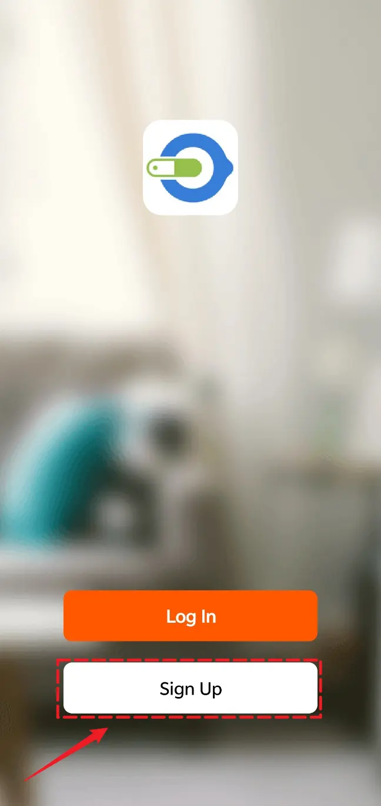

2. Wählen Sie Ihr Land oder Ihre Region aus

3. Markieren Sie, dass Sie den Datenschutzbestimmungen und den Bedingungen zustimmen

4. Geben Sie eine gültige E-Mail-Adresse oder eine Mobiltelefonnummer für die Überprüfung ein

5. Holen Sie sich den Bestätigungscode und geben Sie ihn ein

6. Erstellen Sie ein Passwort und melden Sie sich an

7. Nachdem Sie sich angemeldet haben, folgen Sie den Anweisungen der APP, um der APP die Berechtigungen für die Position und den Bluetooth Ihres Geräts zu erteilen

   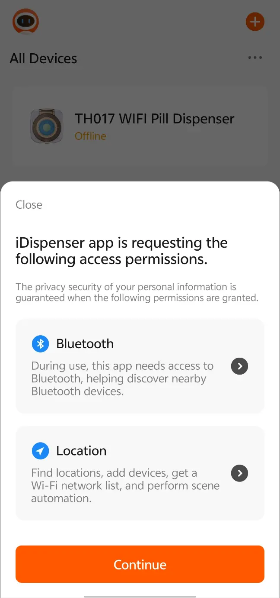

---

## 3. Wi-Fi-Verbindung einrichten

**Gerät wechselt in den AP-Modus**

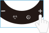

1. Drücken und halten Sie im Home-Uhrmodus des Geräts die "+"-Taste des Geräts 3 Sekunden lang, um den Wi-Fi-AP-Modus zu aktivieren;
2. Zu diesem Zeitpunkt spricht der Lautsprecher "AP Mode" vor, und die LED-Leuchte beginnt zu blinken;
3. Wenn keine Operation innerhalb von 3 Minuten erfolgt, verlässt das Gerät den AP-Modus automatisch und kehrt in den Home-Uhrmodus zurück;
4. Drücken und halten Sie die "+"-Taste des Geräts erneut 3 Sekunden lang, um den AP-Modus zu verlassen.

**Hinweis:** Bluetooth und Standortdienste müssen aktiviert sein, um den Pillenverteiler mit dem Mobilgerät zu koppeln.

---

## 4. Gerätekopplung

### 4.1 Kopplung über Auto Scan abschließen

1. Öffnen Sie die iDispenser APP, klicken Sie auf der APP-Hauptseite auf "Gerät hinzufügen"
2. Warten Sie, bis der automatische Scan im Abschnitt "Geräte suchen" den Pillenverteiler findet, und klicken Sie auf "Hinzufügen", wenn der Pillenverteiler, mit dem Sie verbinden möchten, erscheint
3. Geben Sie den Wi-Fi-Netzwerk-Namen und das Passwort ein, und klicken Sie dann auf "Weiter"
4. Warten Sie, bis sich das Mobilgerät und der Pillenverteiler verbinden

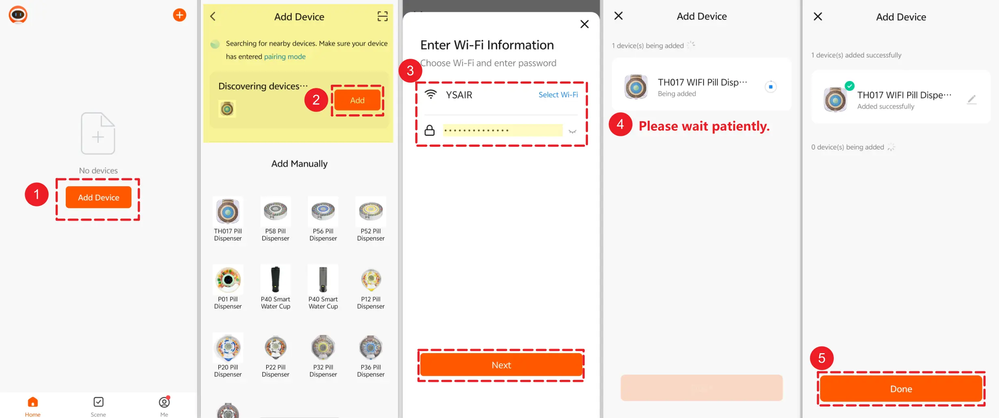

5. Nach erfolgreicher Wi-Fi-Verbindung zeigt die APP "added successfully" an, klicken Sie auf "Done", um zurückzukehren. Zu diesem Zeitpunkt zeigt das Display des Geräts das Symbol "" an.

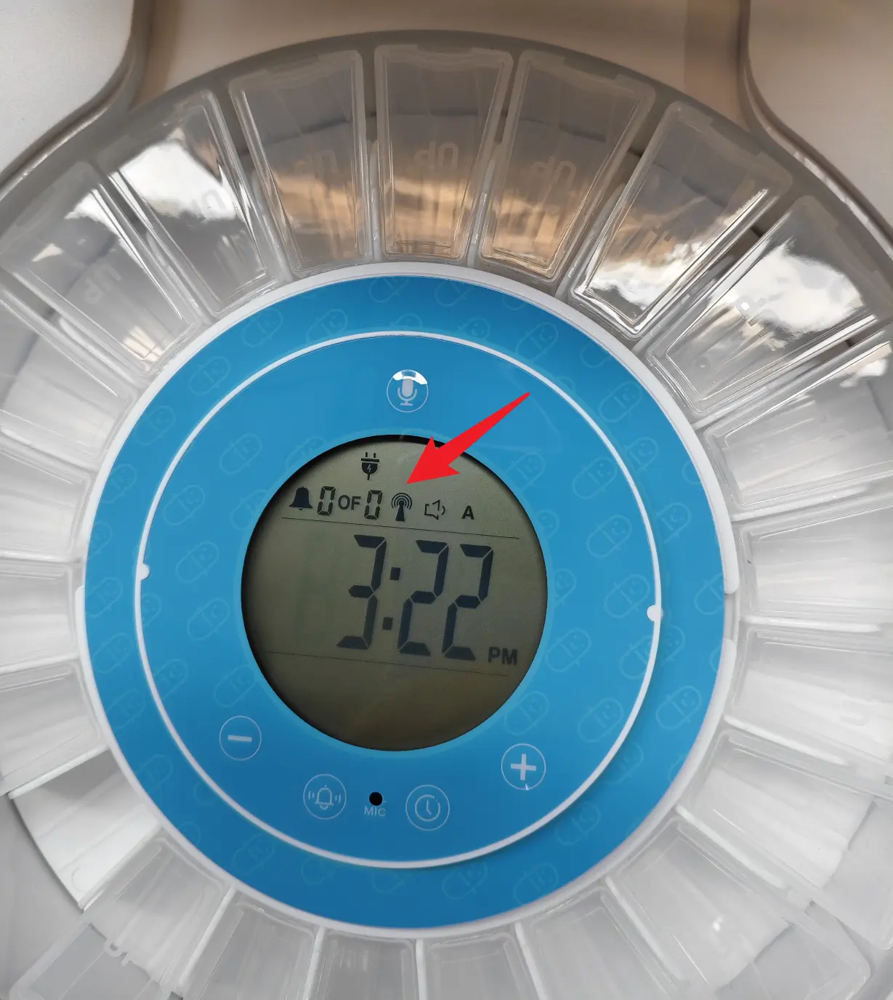

### 4.2 Fehlerbehebung bei Verbindungsproblemen

Wenn die Wi-Fi-Verbindung fehlschlägt, überprüfen Sie bitte folgende Aspekte:

1. Sind Wi-Fi-SSID und Passwort korrekt?
2. Ist Ihr Wi-Fi 5GHz? Bitte stellen Sie es auf 2.4GHz ein.
3. Setzen Sie das Gerät zurück: Drücken und halten Sie die "+"-Taste des Geräts, um den AP-Modus neu zu betreten, und verbinden Sie das Wi-Fi erneut.

**Wichtiger Hinweis:** Sobald der Pillenverteiler mit dem Mobilgerät verbunden ist, wird die auf dem Verteiler angezeigte Zeit mit der Zeit des Mobilgeräts synchronisiert. Wenn das Mobilgerät in eine andere Zeitzone verschoben wird, ändert sich die Zeit des Pillenverteilers nicht, es sei denn, er wird erneut gekoppelt.

---

## 5. APP-Bedienungsanleitung

Auf der Hauptseite klicken Sie auf das Gerät "TH017 WIFI Pill Dispenser", um die Gerätekonfigurationsseite zu öffnen.

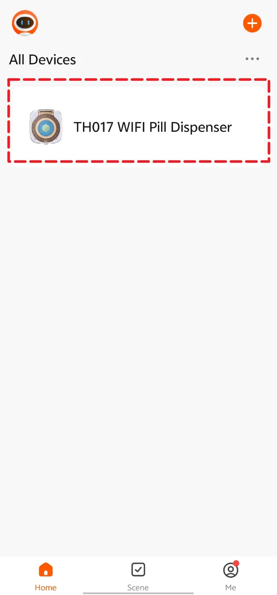

### 5.1 Medikamentenplan einrichten

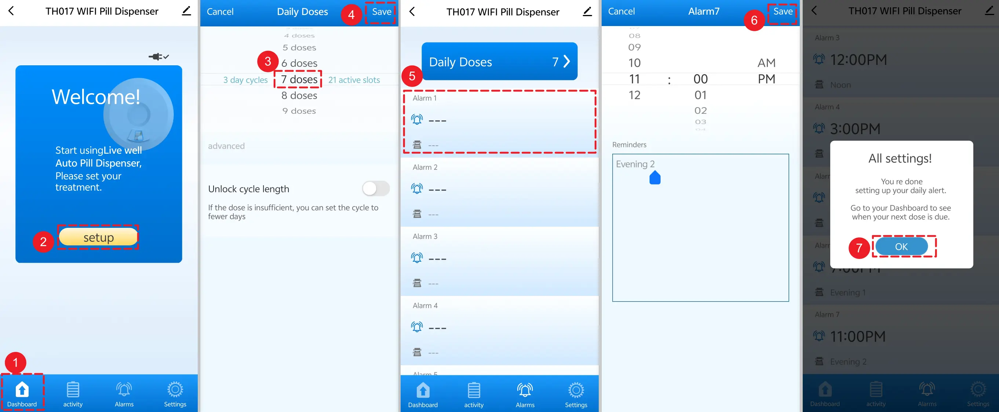

Beim ersten Betrieb des Pillenverteilers über die APP müssen Sie den Medikamentenplan einrichten:

1. Gehen Sie zum Dashboard
2. Klicken Sie auf "Setup"
3. Klicken Sie auf "Daily Doses", um die Anzahl der Tagesdosen auszuwählen
4. Klicken Sie auf "Save", um die Dosiseinstellung zu speichern

**Hinweis:** Sie können "Unlock cycle length" aktivieren, um den Tageszyklus anzupassen, wenn der voreingestellte Tageszyklus Ihren Anforderungen nicht entspricht.

5. Klicken Sie nacheinander auf Alarm 1, 2, 3 usw., um den Alarm einzustellen
6. Stellen Sie die Zeit für die ausgewählte Alarmzeit ein, fügen Sie bei Bedarf Notizen hinzu, und klicken Sie auf "Save", um einen Alarm zu speichern

**Hinweis:** Die gleiche Alarmzeit kann nicht wiederholt eingestellt werden.

7. Nachdem alle Alarme eingestellt sind, erscheint ein Pop-up-Fenster. Klicken Sie in dem Pop-up-Fenster auf "OK".

### 5.2 Dashboard-Übersicht

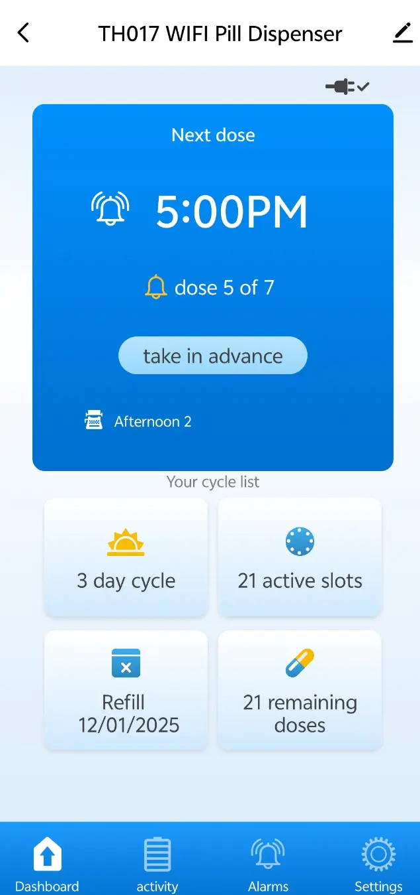

**Nächste Dosis**

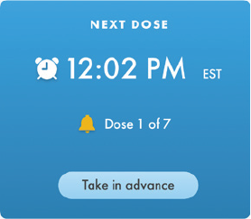 Zeigt die Zeit der nächsten Dosis, die Dosennummer, die Gesamtanzahl der Dosen, Notizen für die nächste Dosis und die Option, die Medikamente im Voraus einzunehmen

**Tageszyklus**

 Zeigt den aktuell ausgewählten Tageszyklus

**Aktive Fächer**

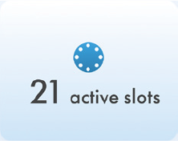 Zeigt die Anzahl der verwendeten Medikamentenboxen (Beispiel: 21 aktive Fächer)

**Endet**

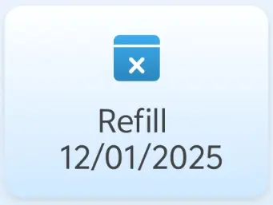 Zeigt das Datum, an dem der Pillenverteiler nachgefüllt werden muss

**Verbleibende Dosen**

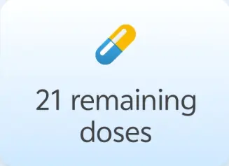 Zeigt, wie viele Dosen noch eingenommen werden müssen (Beispiel: 21 Dosen übrig)

**Steckersymbol**

 Gibt an, dass der Pillenverteiler an ein Stromkabel angeschlossen ist

**Hinweis:** Wenn der Pillenverteiler vom Strom getrennt wird, verschwindet das Steckersymbol aus dem Dashboard.

### 5.3 Medikamentenerinnerungen

**Wenn es Zeit ist, die Medikamente einzunehmen:**

1. Das Fenster für die nächste Dosis wird rot

2. Der Alarm klingelt (falls der Verteiler nicht stummgeschaltet ist)

3. Klicken Sie auf "Silence Alarm" und bestätigen Sie, um den Alarmton auszuschalten

4. Nachdem Sie die Medikamente eingenommen haben, wird das Fenster für die nächste Dosis wieder blau und zeigt die nächste Dosis im Plan an

5. Der Pillenverteiler verfügt über einen eingebauten Sensor, der erkennen kann, wann Medikamente aus der Medikamentenbox entnommen werden

   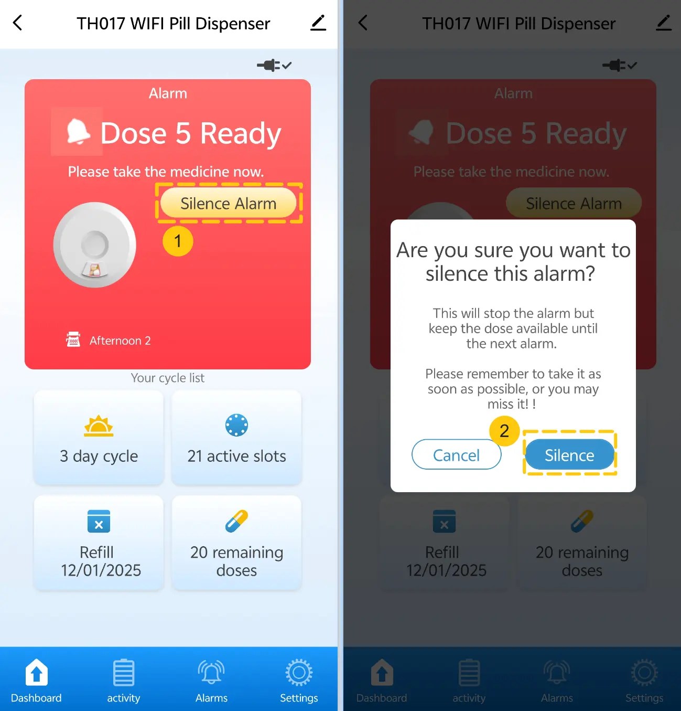

**Medikamente im Voraus einnehmen**

Um Medikamente vor der vorgesehenen Zeit einzunehmen:
1. Klicken Sie auf "Take in advance"
2. Ein Pop-up-Fenster wird erscheinen, um Ihre Auswahl zu bestätigen, klicken Sie auf "OK"
3. Wie zur geplanten Zeit wird das Fenster für die nächste Dosis rot und der Alarm klingelt
4. Dann können Sie die Medikamente normal einnehmen

**Hinweis:** Wenn Sie versuchen, Medikamente einen Tag im Voraus einzunehmen, funktioniert die Schaltfläche "Take in advance" nicht.

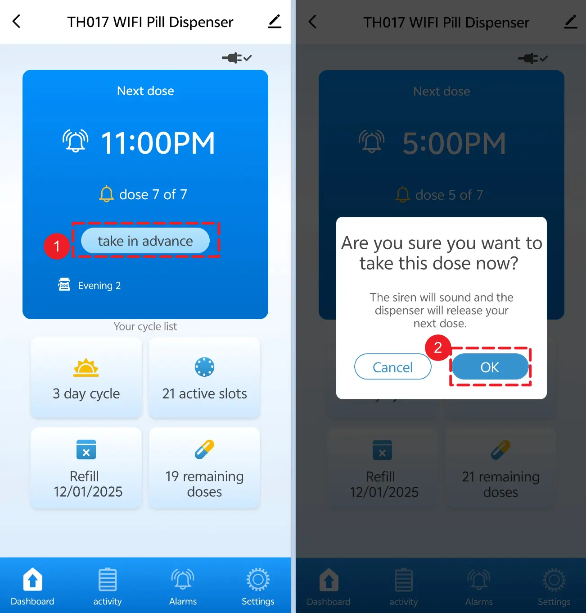

### 5.4 Aktivitätsübersicht

| Aktivitätsübersicht zeigt Aufzeichnungen darüber, wann Benutzer Medikamente eingenommen haben | Bestimmung der Medikamenteneinnahmezeit |
| ------------------------------------------------------------ | ------------------------------------------------------------ |
| **Grünes Symbol:** Medikamente pünktlich eingenommen | **Pünktlich:** Das Einnahme von Medikamenten innerhalb der eingestellten initialen Alarmdauer oder das Einnahme von Medikamenten innerhalb der Timeout-Alarmdauer nach Ende des initialen Alarms wird als pünktliche Einnahme von Medikamenten aufgezeichnet |
| **Gelbes Symbol:** Verspätete Medikamenteneinnahme | **Verspätet:** Das Einnahme von Medikamenten nach Ende des initialen Alarms und Überschreitung der Timeout-Alarmdauer, aber das Abschluss der Medikamenteneinnahme vor dem nächsten Alarm, wird als verspätete Medikamenteneinnahme aufgezeichnet |
| **Rotes Symbol:** Ausgelassene Medikamenteneinnahme | **Ausgelassen:** Das nie Einnahme von Medikamenten und das Klingeln des nächsten Alarms wird als ausgelassene Medikamenteneinnahme aufgezeichnet |

Die Alarmdauer ist standardmäßig auf 30 Minuten eingestellt, kann aber angepasst werden (siehe Abschnitt "Einstellungenübersicht").

**Hinweis:** Aufzeichnungen werden nach 14 Tagen gelöscht.

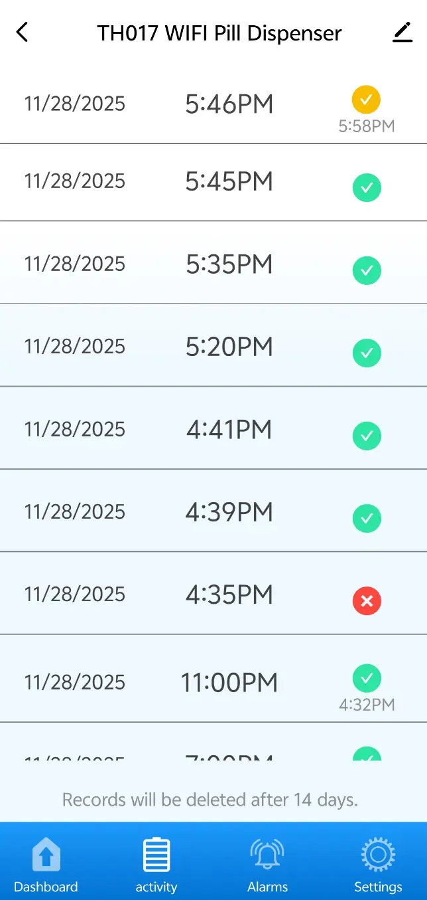

### 5.5 Alarmsübersicht

Die Alarmoberfläche ermöglicht es Ihnen, bestehende Alarme zu bearbeiten oder neue Medikamentenpläne einzurichten.

**Hinweis:** Wenn Sie einen neuen Medikamentenplan einrichten, dreht sich der Pillenverteiler automatisch und setzt sich auf die Startposition zurück.

**Alarm bearbeiten:**

1. Klicken Sie auf einen der Alarmzeiträume
2. Passen Sie die Zeit an oder bearbeiten Sie die Notizen für diesen Alarm
3. Klicken Sie auf "Save", um die Änderungen zu bestätigen

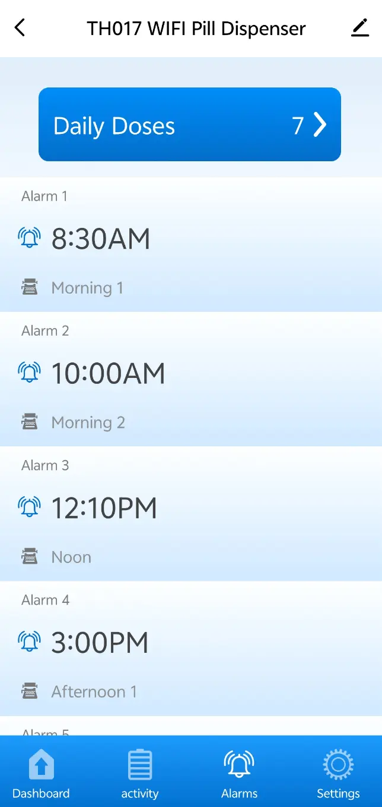

### 5.6 Einstellungenübersicht

Die Einstellungsoberfläche ermöglicht es Ihnen, die folgenden Optionen zu ändern:

- **Zeitzone:** Ändern der Zeitzone
- **24-Stunden-Uhr:** Aktivieren, um die Zeit im 24-Stunden-Format anzuzeigen
- **Auffüll-Erinnerung:** Erinnerung an die Auffüllung am Ende des Zyklus, kann den verbleibenden Dosenschwellenwert anpassen, der die Auffüll-Erinnerung auslöst, Anpassungsbereich: 1~9 Dosen
- **Lautstärke:** Anpassen zwischen hoch, mittel, niedrig und stumm
- **Klingelton:** Wählen zwischen drei Alarmklingeltönen A, B und C
- **Initiale Alarmdauer:** Anpassen der initialen Alarmdauer, Auswahlbereich von 5 Minuten bis 2 Stunden. (Wenn nach dem Klingeln des initialen Alarms keine Medikamente eingenommen werden, beginnt der Timeout-Alarm)
- **Timeout-Alarmdauer:** Anpassen der Timeout-Alarmdauer, Auswahlbereich von 4 Minuten bis 1 Stunde. (Dies stoppt den Alarm, aber die Dosis bleibt bis zum nächsten Alarm erhalten. Bitte nehmen Sie sie so schnell wie möglich ein, sonst wird es als Nichtbeachtung der Arztanweisungen aufgezeichnet)
- **Alarm zurücksetzen:** Setzen Sie alle Alarme zurück
- **Alles zurücksetzen:** Setzen Sie alles zurück und beginnen Sie von vorne

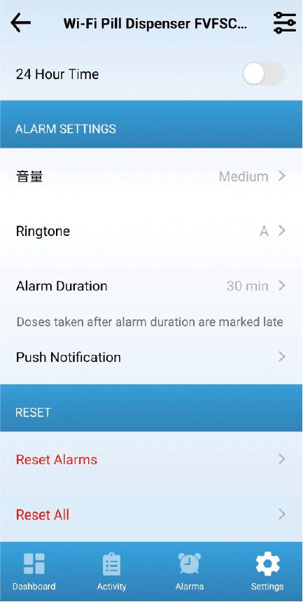

### 5.7 Optionenübersicht

1. Klicken Sie auf das Optionen--Symbol in der oberen rechten Ecke des Bildschirms, um die Optionenoberfläche zu öffnen.

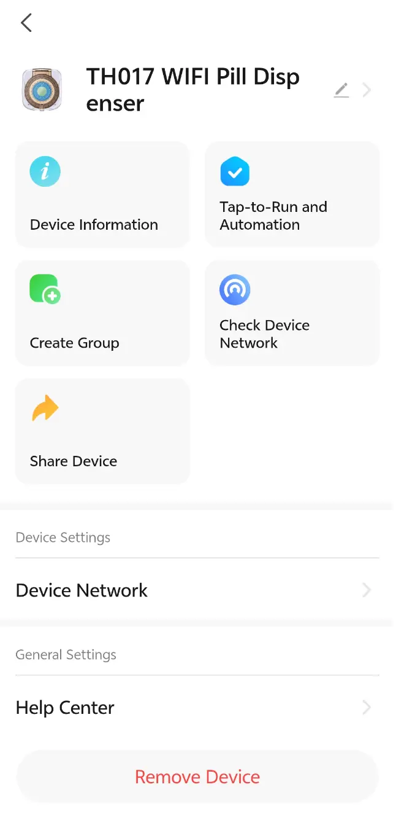

2. Auf dieser Oberfläche können Sie:

- ：Den Namen des Pillenverteilers ändern
- Device Information：Geräteinformationen anzeigen 
- Device Network：Gerätenetzwerk anzeigen 
- Share Device：Gerät freigeben, kann Pillenverteilerinformationen mit anderen APP-Benutzern teilen
- Remove Device：Das Gerät vollständig aus der APP entfernen

### 5.8 Gerät freigeben (Share Device)

**Freigeben：**

1. Klicken Sie auf das Optionen--Symbol in der oberen rechten Ecke des Bildschirms, um die Optionenoberfläche zu öffnen.
2. Klicken Sie auf "Share Device", um die Freigabeoberfläche zu öffnen

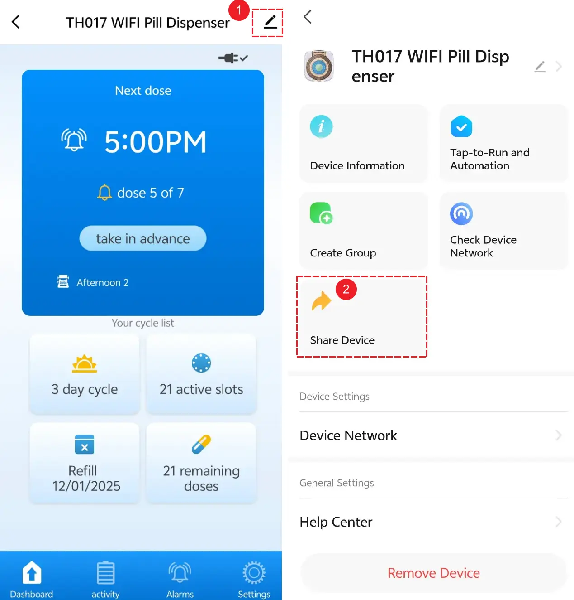

3. Fügen Sie freigegebene Konten hinzu, es gibt zwei Methoden:

   ***Methode 1：***Klicken Sie auf Add, wählen Sie Region (Land oder Region, in der sich das Zielkonto befindet), füllen Sie Account (E-Mail-Adresse des Zielkontos) aus und klicken Sie dann auf Done, um die Hinzufügung abzuschließen. Zu diesem Zeitpunkt können Ihre Familienmitglieder auf das Gerät zugreifen.

   Hinweis: Das aktuelle Konto und das Ziel-Freigabekonto müssen sich im selben Land oder derselben Region befinden, sonst kann ein Fehler auftreten und das Zielkonto kann nicht hinzugefügt werden.

   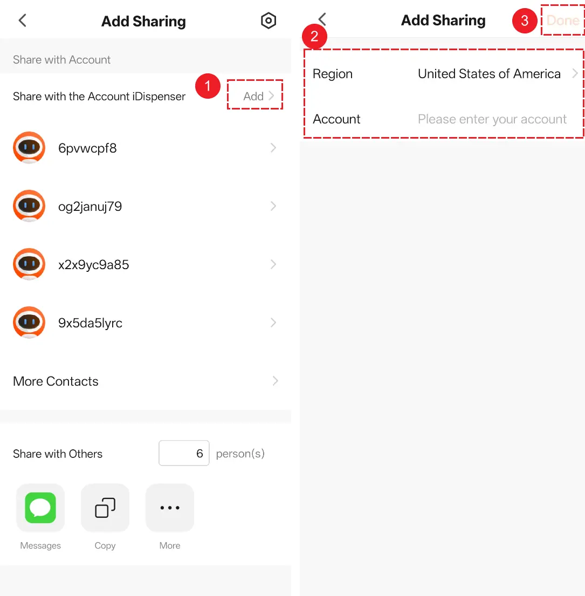

   ***Methode 2：***Geben Sie ein, mit wie vielen Konten Sie teilen möchten (maximal 6 Personen), klicken Sie dann auf Copy, um den Freigabelink zu kopieren, und teilen Sie ihn über Ihr Social-Media-Konto mit Ihren Familienmitgliedern. Ihre Familienmitglieder klicken auf den Link, springen und akzeptieren die Einladung, dann können sie auf das Gerät zugreifen.

   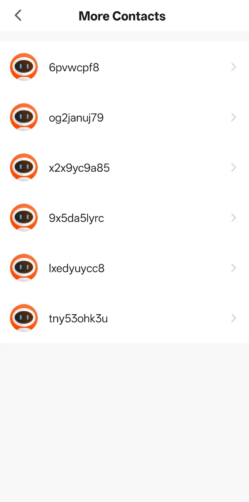

**Freigabe entfernen：**

Angesichts des Nutzungsszenarios der Medikamentenbox müssen Sie zum Entfernen der Freigabe den Entfernungsvorgang sowohl auf dem Hauptfreigabekonto als auch auf dem freigegebenen Konto durchführen, um die Entfernung der Freigabefunktion abzuschließen.

1. Auf dem Hauptfreigabekonto wischen Sie auf das Konto, von dem Sie die Freigabe entfernen möchten, nach links und klicken Sie auf "Delete", es erscheint ein Bestätigungsfenster, klicken Sie auf "Delete", um die Entfernung abzuschließen.

   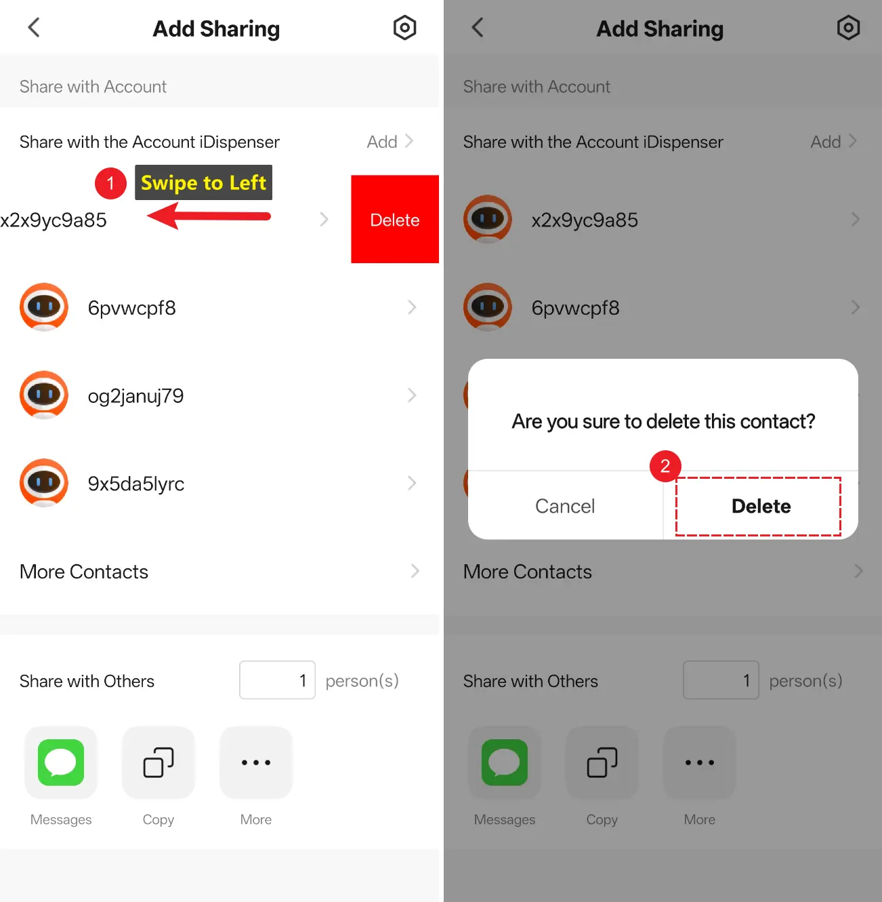

2. Auf dem freigegebenen Konto klicken Sie auf das Optionen--Symbol in der oberen rechten Ecke des Bildschirms, um die Optionenoberfläche zu öffnen, klicken Sie auf "Remove Sharing", um die Entfernung abzuschließen.

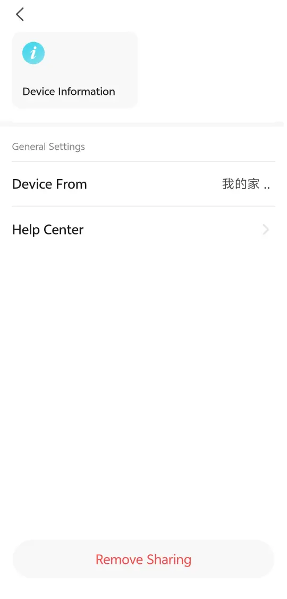

---

## 6. Geräteverwaltung

### 6.1 APP-Benachrichtigungseinstellungen

Wählen Sie auf der Hauptseite: Me → Settings → APP notification

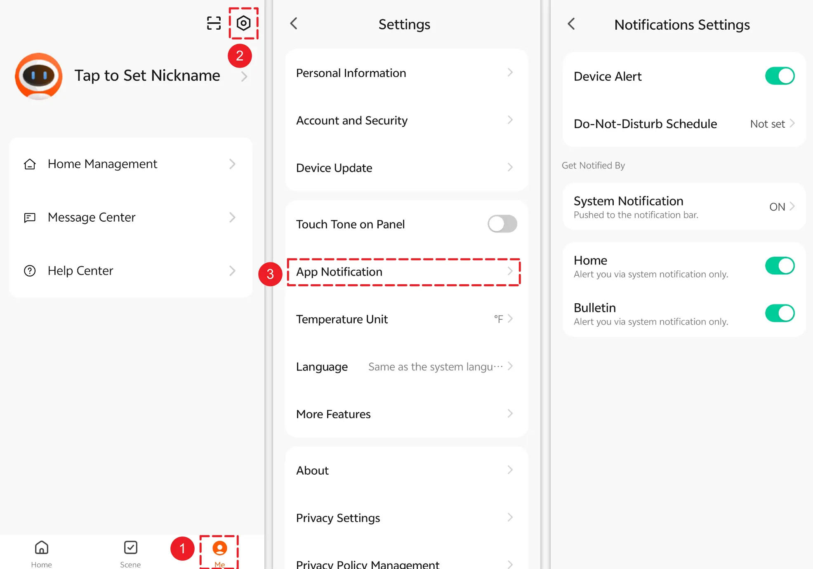

### 6.2 Gerät entfernen

1. Klicken Sie auf der Hauptseite auf die Schaltfläche "..." in der oberen rechten Ecke, wählen Sie "Device Management" und gelangen Sie zur Seite "Device Selected";

2. Wählen Sie ein oder mehrere zu entfernende Geräte;

3. Klicken Sie auf das Symbol "Remove device", ein Hinweis "Delete device or dismiss group？" wird angezeigt, klicken Sie auf "Confirm", um die Löschung zu bestätigen;

4. Klicken Sie auf "Done", um zur Hauptseite zurückzukehren.

   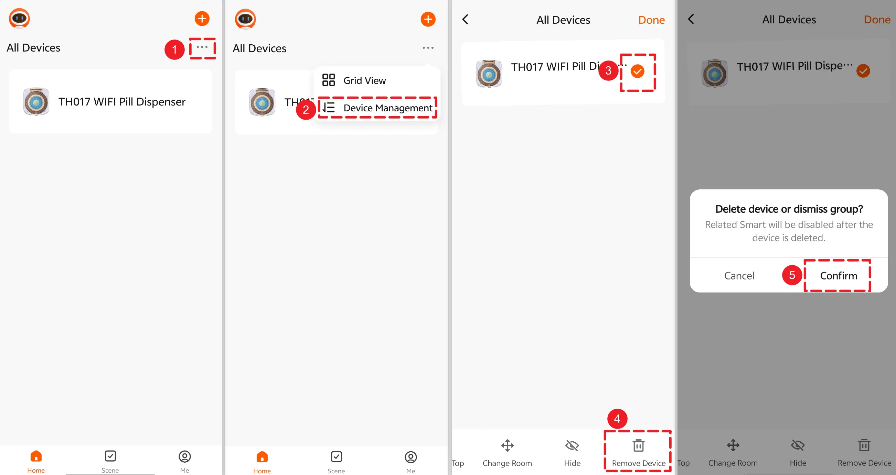

---

## 7. Bedienung des Pillenverteilers

### Grundlegende Betriebsschritte

1. **Tägliche Doseringen wählen:** Wählen Sie die tägliche Doseringen, die Ihren Bedürfnissen entspricht (siehe Abschnitt "Understanding Daily Dose Rings" in der Bedienungsanleitung)

2. **Doseringen und Medikamente platzieren:**
   - Platzieren Sie die tägliche Doseringen in der Mitte der inneren Medikamentenbox
   - Füllen Sie die Medikamente in die Medikamentenbox ein, entsprechend der Einnahmezeit (1., 2., 3. usw.)
   - Platzieren Sie sie gemäß den Zahlen (1, 2, 3 usw.) auf dem Ring
   - Platzieren Sie keine Medikamente im weißen Bereich
   - Wenn Sie den weißen Bereich sich dem Medikamentenausgang nähern sehen, ist es Zeit, nachzufüllen

3. **Batterie installieren:** Siehe Abschnitt "Install Battery" in der Bedienungsanleitung

4. **Deckel entsperren:**
   - Verwenden Sie den Schlüssel, um den Deckel zu entsperren (siehe Abschnitt "Locking and Unlocking the Cover")
   - Setzen Sie die Medikamententasse in das Innere des Körpers

5. **Netzkabel einstecken**

6. **Mit Wi-Fi-Netzwerk verbinden:** Verwenden Sie die iDispenser APP, um zu verbinden (siehe Abschnitt "Wi-Fi Setup")

7. **Zeit einstellen:** Siehe Abschnitt "Set Time" in der Bedienungsanleitung

8. **Einstellungen anpassen:**
   - Passen Sie die Lautstärke, das Datumsformat und das Zeitformat von der iDispenser APP aus an (siehe Abschnitt "Settings Overview")
   - Oder passen Sie die Alarm Lautstärke, den Alarmtyp und wählen Sie das 12- oder 24-Stunden-Format auf dem Verteiler aus (siehe entsprechende Abschnitte in der Bedienungsanleitung)

9. **Medikamentenzeit einstellen:**
   - Richten Sie den Medikamentenplan von der iDispenser APP aus ein (siehe Abschnitt "Setting Medication Schedule")
   - Oder stellen Sie die Medikamentenalarmzeit auf dem Verteiler ein (siehe Abschnitt "Setting Alarms" in der Bedienungsanleitung)

10. **Deckel sperren:** Verwenden Sie den mitgelieferten Schlüssel, um den Deckel zu schließen und zu sperren

11. **Automatisches Medikamentenausbringen:** Zu der angegebenen Medikamenteneinnahmezeit klingelt der Alarm, und die Medikamententasse fährt automatisch heraus

12. **Alarm stoppen:** Wenn Sie die Medikamententasse herausnehmen, sollte der Alarm automatisch stoppen

13. **Medikamententasse zurückbringen:** Nach dem Einnahme der Medikamente bringen Sie die Medikamententasse zurück in den Ausgang, bis Sie ein "Klick"-Geräusch hören, was anzeigt, dass die Medikamententasse an der richtigen Position ist

14. **Gerät platzieren:** Platzieren Sie den Pillenverteiler auf einer ebenen Oberfläche

---

## 8. Pflege und Wartung

- **Außenreinigung:** Wischen Sie die Außenseite mit einem weichen feuchten Tuch ab. Verwenden Sie keine aggressiven Reinigungsmittel

- **Innere Medikamentenbox reinigen:**
  - Entfernen Sie die innere Medikamentenbox, falls erforderlich
  - Spülen Sie/ wischen Sie jede Medikamentenfächern vorsichtig ab
  - Lassen Sie den Behälter vor der Wiedereinstellung oder dem Nachfüllen vollständig trocknen

- **Wasserdichtheitshinweise:** Tauchen Sie den externen Pillenverteiler nicht in Wasser oder irgendeine andere Flüssigkeit ein

- **Sauber halten:** Stellen Sie sicher, dass die innere Medikamentenbox vor dem Nachfüllen sauber und trocken ist

---

## Hinweis

- Wi-Fi, WPA und WPA2 sind Marken der Wi-Fi Alliance in den Vereinigten Staaten und/oder anderen Ländern
- Bluetooth ist eine Marke der Bluetooth SIG, Inc. USA
- Android und Google Play sind Marken von Google LLC
- Apple, iOS und App Store sind Marken von Apple Inc. in den Vereinigten Staaten und anderen Ländern
- Alle anderen Produkte, Markennamen, Firmennamen und Logos sind Marken ihrer jeweiligen Eigentümer und werden nur zur Identifizierung ihrer jeweiligen Produkte verwendet, und implizieren keine Sponsoring, Unterstützung oder Genehmigung

---

**Bei Fragen wenden Sie sich bitte an den Retekess-Kundenservice. Kontaktdaten finden Sie auf der Produktverpackung oder im gedruckten Handbuch**