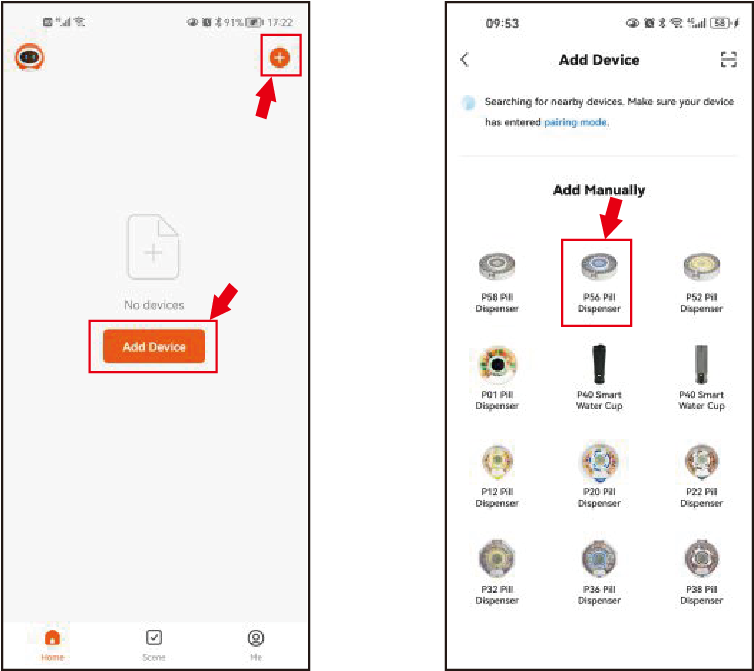
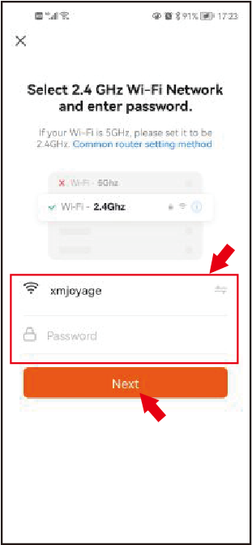
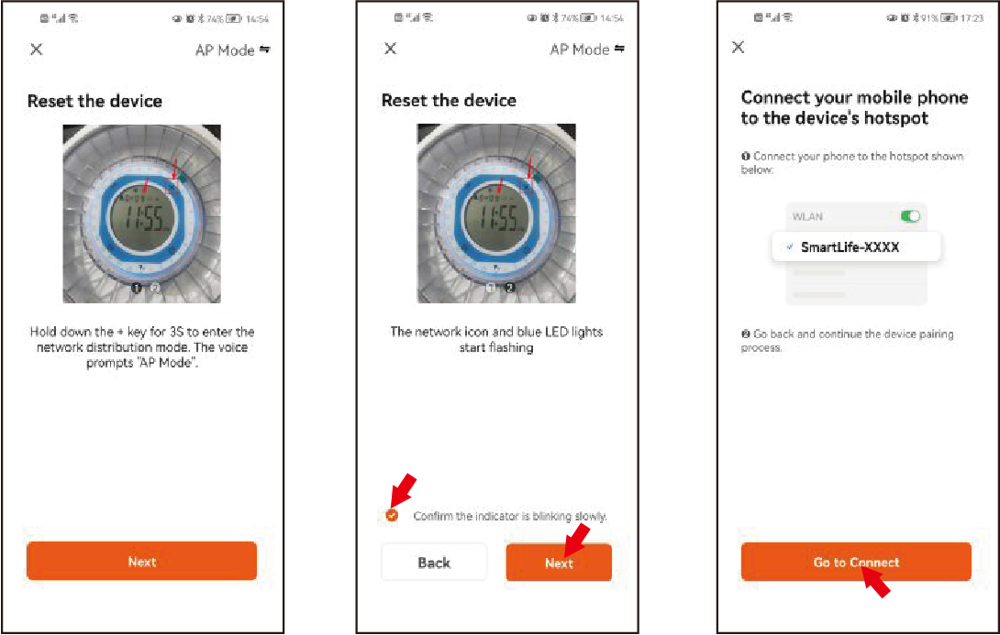
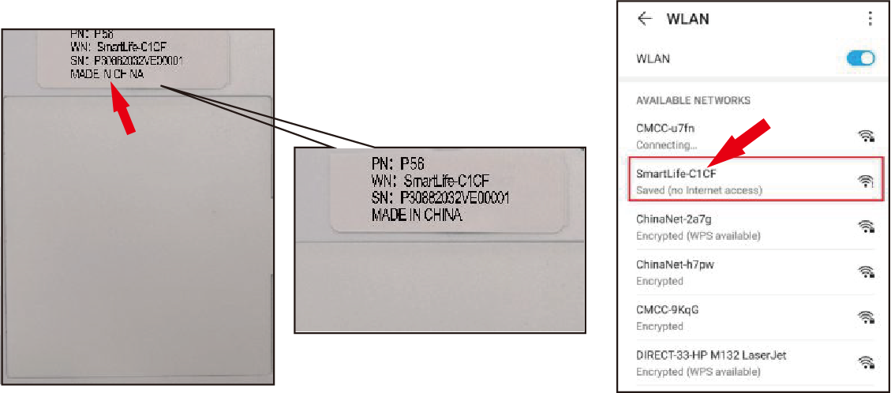
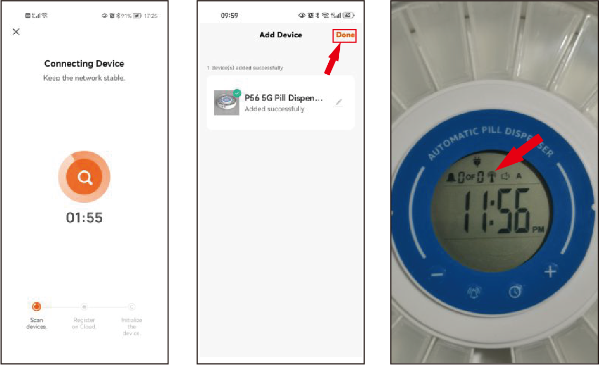
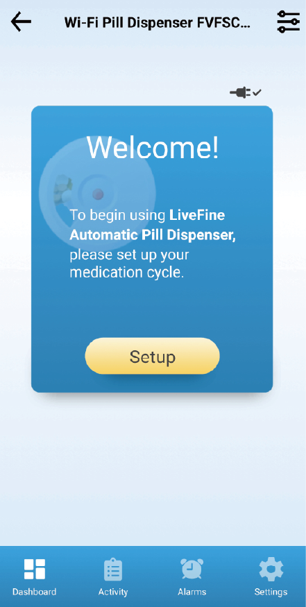
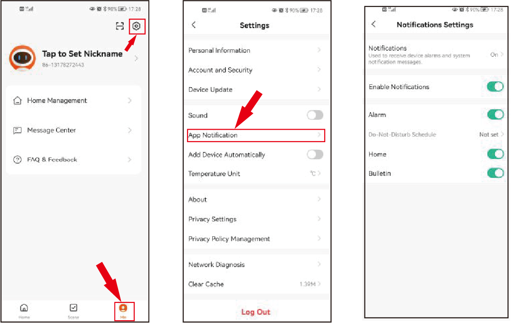
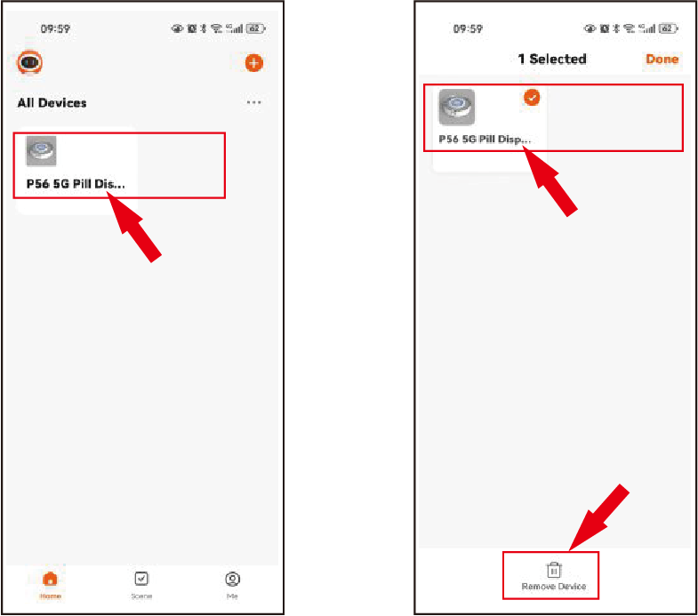

### Manual de Usuario de la Aplicación del Dispensador Automático de Pastillas Retekess TH017

🇺🇸 [English](https://github.com/dennischancs/retekess-dispenser/blob/main/README.md) | 🇫🇷 [Français](https://github.com/dennischancs/retekess-dispenser/blob/main/README-FR.md) | 🇩🇪 [Deutsch](https://github.com/dennischancs/retekess-dispenser/blob/main/README-DE.md) | 🇮🇹 [Italiano](https://github.com/dennischancs/retekess-dispenser/blob/main/README-IT.md) | 🇪🇸 [Español](https://github.com/dennischancs/retekess-dispenser/blob/main/README-ES.md) | 🇷🇺 [Русский](https://github.com/dennischancs/retekess-dispenser/blob/main/README-RU.md) | 🇵🇹 [Português](https://github.com/dennischancs/retekess-dispenser/blob/main/README-PT.md) | 🇯🇵 [日本語](https://github.com/dennischancs/retekess-dispenser/blob/main/README-JP.md) | 🇨🇳 [简体中文](https://github.com/dennischancs/retekess-dispenser/blob/main/README-CN.md)

---

## 1. Descarga e Instalación de la Aplicación

Descargue e instale la aplicación iDispenser en su smartphone o en el de su cuidador mediante los siguientes métodos:

- Usuarios de iOS: Visite App Store
- Usuarios de Android: Visite Google Play o descargue directamente

---

## 2. Registro de Cuenta

Si está usando iDispenser por primera vez, por favor cree una cuenta:

1. Abra la aplicación iDispenser y haga clic en "Registrarse"
2. Acepte los términos y condiciones de la Política de Privacidad
3. Introduzca una dirección de correo electrónico válida o número de teléfono para verificación
4. Obtenga el código de verificación e introdúzcalo
5. Cree una contraseña e inicie sesión

---

## 3. Configuración de Conexión Wi-Fi

### Dispositivo Entrando en Modo AP

1. En el modo reloj principal del dispositivo, mantenga presionado el botón "+" del dispositivo durante 3 segundos para entrar en modo Wi-Fi AP;
2. En este momento, el altavoz emitirá la voz "AP Mode" y la luz LED comenzará a parpadear;
3. Si no hay operación dentro de 3 minutos, el dispositivo saldrá automáticamente del modo AP y volverá al modo reloj principal;
4. Mantenga presionado el botón "+" del dispositivo durante 3 segundos nuevamente para salir del modo AP.

**Nota:** Es necesario habilitar Bluetooth y servicios de ubicación para emparejar el dispensador de pastillas con el dispositivo móvil.

---

## 4. Métodos de Emparejamiento del Dispositivo

### Método 1: Escaneo Automático

1. Abra la aplicación iDispenser y haga clic en "Agregar Dispositivo" en la página principal de la APP
2. Espere a que el escaneo automático encuentre el dispensador de pastillas en la sección "Descubriendo Dispositivos"
3. Cuando aparezca el dispensador de pastillas a conectar, haga clic en "Ir a Agregar"
4. Ingrese el nombre de la red Wi-Fi y la contraseña, luego haga clic en "Siguiente"
5. Espere a que el dispositivo móvil y el dispensador de pastillas se conecten

### Método 2: Agregar Manualmente

1. Abra la aplicación iDispenser y haga clic en el botón "⊕" en la página principal de la APP para ingresar a la página "Agregar Dispositivo"
2. Seleccione Otros → Otros(Wi-Fi)
3. Haga clic en el dispensador de pastillas a conectar
4. Asegúrese de que el dispensador de pastillas esté alimentado y en modo AP, luego haga clic en "Siguiente"

5. Ingrese la contraseña Wi-Fi (la misma que la contraseña Wi-Fi del teléfono móvil), haga clic en "Siguiente"

6. En la página del modo AP, haga clic en "Siguiente"

7. Haga clic en "Ir a Conectar" y seleccione el SSID Wi-Fi coincidente

8. Vaya a la configuración Wi-Fi del teléfono y seleccione "TH017-XXXX" de la lista para conectar el dispensador
9. Regrese a la APP y espere a que el dispositivo móvil y el dispensador de pastillas se conecten
10. Después de una conexión exitosa, haga clic en "Hecho"
11. Después de una conexión AP exitosa, haga clic en "Atrás" para regresar a la página "Agregar Dispositivo"

### Indicador de Conexión Exitosa

Después de una conexión Wi-Fi exitosa, se mostrará el símbolo "" en la pantalla del dispositivo.

### Solución de Problemas de Fallos de Conexión

Si falla la conexión Wi-Fi, por favor verifique los siguientes aspectos:

1. ¿Son correctos el SSID Wi-Fi y la contraseña?
2. ¿Su Wi-Fi es de 5GHz? Por favor configúrelo a 2.4GHz.
3. Reiniciar el dispositivo: Mantenga presionado el botón "+" del dispositivo para volver a entrar en modo AP y reconectar Wi-Fi.

**Nota Importante:** Una vez que el dispensador de pastillas se conecta al dispositivo móvil, la hora mostrada en el dispensador se sincronizará con la hora del dispositivo móvil. Si el dispositivo móvil se mueve a una zona horaria diferente, la hora del dispensador de pastillas no cambiará a menos que se vuelva a emparejar.

---

## 5. Guía de Operación de la APP

### 5.1 Configuración del Horario de Medicamentos

Cuando opere el dispensador de pastillas a través de la APP por primera vez, necesita configurar un horario de medicamentos:

1. En el Tablero, haga clic en "Configurar"
2. Haga clic en "Dosis por día" para seleccionar el número de dosis por día
3. Haga clic en "Guardar" para guardar la selección de dosis

**Nota:** Puede abrir "Desbloquear Duración del Ciclo" para personalizar el ciclo diario si el ciclo diario preestablecido no cumple con sus necesidades.

4. Seleccione períodos de tiempo de alarma para establecer alarmas
5. Establezca horas para los períodos de alarma seleccionados, agregue observaciones si es necesario

**Nota:** No se puede establecer repetidamente la misma hora de alarma.

6. Después de configurar todas las alarmas, aparecerá una ventana emergente. Haga clic en "Aceptar" en la ventana emergente. El dispensador girará automáticamente la bandeja de vuelta a la posición inicial
7. Aparecerá otra ventana emergente, indicando que su bandeja está lista. Haga clic en "Aceptar" en la ventana emergente

### 5.2 Vista General del Tablero

#### Próxima Dosis

 Muestra la hora de la próxima dosis, número de dosis, dosis totales, observaciones para la próxima dosis, y la opción de tomar medicina por adelantado

#### Ciclo Diario

 Muestra el ciclo diario actualmente seleccionado

#### Compartimentos Activos

 Muestra el número de cajas de medicamentos en uso (por ejemplo, 21 compartimentos activos)

#### Finaliza

 Muestra la fecha en que el dispensador de pastillas necesita ser rellenado

#### Dosis Restantes

 Muestra cuántas dosis quedan por tomar (por ejemplo, 21 dosis restantes)

#### Icono de Enchufe

 Indica que el dispensador de pastillas está conectado al cable de alimentación

**Nota:** Si el dispensador de pastillas se desconecta, el icono del enchufe desaparecerá del tablero.

### 5.3 Recordatorio de Medicamentos

Cuando es hora de tomar medicamentos:

1. La ventana de la próxima dosis se volverá roja
2. Sonará la alarma (si el dispensador no está silenciado)
3. Haga clic en "Silenciar esta alarma" para apagar la alarma
4. Después de tomar los medicamentos, la ventana de la próxima dosis volverá a azul y mostrará la próxima dosis programada
5. El sensor incorporado en el dispensador de pastillas puede detectar cuando se sacan medicamentos de la caja de medicamentos

#### Tomar Medicamentos por Adelantado

Para tomar medicamentos antes de la hora establecida:
1. Haga clic en "Tomar por adelantado"
2. Aparecerá una ventana emergente confirmando su elección, haga clic en "Aceptar"
3. Al igual que en la hora programada, la ventana de la próxima dosis se volverá roja y sonará la alarma
4. Entonces puede tomar la medicina normalmente

**Nota:** Si intenta tomar medicamentos un día antes, el botón "Tomar por adelantado" no funcionará.

### 5.4 Vista General de Actividades

La interfaz de actividades muestra registros de cuándo los usuarios tomaron sus medicamentos:

- **Símbolo Verde:** Tomó medicina a tiempo
- **Símbolo Amarillo:** Tomó medicina tarde
- **Símbolo Rojo:** Se perdió la medicina

Puede hacer clic en el icono de observación junto al tiempo para ver observaciones para esa dosis específica.

#### Determinación del Tiempo de Medicamentos

- **A Tiempo:** Tomó medicina durante la duración de alarma establecida
- **Tarde:** Tomó medicina después de la duración de alarma pero antes de la próxima alarma
- **Perdido:** Nunca tomó medicina y ya ha sonado la próxima alarma

La duración de alarma está establecida en 30 minutos por defecto, pero se puede ajustar (ver sección "Vista General de Configuración").

**Nota:** Los registros comenzarán a eliminarse después de 14 días.

### 5.5 Vista General de Alarmas

La interfaz de alarmas le permite editar alarmas establecidas o configurar un nuevo horario de medicamentos.

**Nota:** Si se establece un nuevo horario de medicamentos, el dispensador de pastillas girará automáticamente y se reiniciará a la posición inicial.

**Editar Alarmas:**
1. Haga clic en uno de los períodos de tiempo de alarma
2. Ajuste la hora o edite las observaciones para esa alarma
3. Haga clic en "Guardar" para confirmar los cambios

### 5.6 Vista General de Configuración

La interfaz de configuración le permite cambiar las siguientes opciones:

- **Formato de Fecha:** Cambiar el formato de visualización de fecha

- **Hora de 24 Horas:** Activar para mostrar la hora en formato de 24 horas

- **Volumen:** Ajustar entre alto, medio, bajo y silenciar

- **Tono de Alarma:** Elegir entre 2 tonos de alarma

- **Duración de Alarma:** Ajustar la duración de alarma, rango seleccionable de 5 minutos a 2 horas

- **Notificaciones Push:** Activar notificaciones para recibir los siguientes recordatorios:
  - Recordatorio de relleno
  - Recordatorio de preparación de medicamentos
  - Recordatorio de medicamentos tomados
  - Recordatorio de medicamentos perdidos
  
  Estas notificaciones se recibirán incluso cuando la APP no esté abierta. Puede activar todas o parte de las notificaciones.

- **Restablecer Alarmas:** Restablecer todas las alarmas

- **Restablecer Todo:** Restablecer todo y comenzar de nuevo

### 5.7 Vista General de Opciones

Haga clic en el icono de opciones  en la esquina superior derecha de la pantalla para ingresar a la interfaz de opciones.

En esta interfaz puede:
- Ver información del dispositivo
- Ver red del dispositivo
- Cambiar el nombre del dispensador de pastillas
- Compartir información del dispensador de pastillas con otros usuarios de la APP
- Eliminar completamente el dispositivo de la APP

#### Actualizaciones del Dispositivo

La aplicación iDispenser le notificará cuando el dispensador de pastillas necesite actualizarse:
1. Cuando aparezca una ventana emergente, haga clic en "Actualizar Ahora" para ingresar a la página de actualización del dispositivo
2. Haga clic en "Actualizar" para comenzar la actualización

---

## 6. Gestión del Dispositivo

### 6.1 Configuración de Notificaciones de la APP

En la página principal, seleccione: Yo → Configuración → Notificación de APP

### 6.2 Eliminar Dispositivo

1. En la página principal, mantenga presionado el icono "Dispositivo" durante 2 segundos para ingresar a la página "Dispositivo Seleccionado"
2. Seleccione uno o más dispositivos para eliminar
3. Haga clic en el icono "Eliminar dispositivo"
4. Haga clic en "Hecho" para regresar a la página principal

---

## 7. Operación del Dispensador de Pastillas

### Pasos Básicos de Operación

1. **Seleccionar Anillo de Dosis Diaria:** Seleccione el anillo de dosis diaria que satisfaga sus necesidades (por favor consulte la sección "Entendiendo los Anillos de Dosis Diaria" en el manual)

2. **Colocar Anillo de Dosis y Medicamentos:**
   - Coloque el anillo de dosis diaria en el centro de la caja de medicamentos interna
   - Coloque los medicamentos en la caja de medicamentos correspondiente al tiempo de dosificación (1ª, 2ª, 3ª, etc.)
   - Coloque según los números en el anillo (1, 2, 3, etc.)
   - No coloque ningún medicamento en las secciones blancas
   - Cuando vea el blanco acercándose al puerto de dispensación, es hora de rellenar

3. **Instalar Baterías:** Por favor consulte la sección "Instalación de Baterías" en el manual

4. **Desbloquear Tapa:**
   - Use la llave para desbloquear la tapa (por favor consulte la sección "Bloqueo y Desbloqueo de la Tapa")
   - Coloque la copa de medicamentos dentro del cuerpo principal

5. **Conectar Cable de Alimentación**

6. **Conectar a Red Wi-Fi:** Use la aplicación iDispenser para conectar (por favor consulte la sección "Configuración Wi-Fi")

7. **Establecer Hora:** Por favor consulte la sección "Establecer Hora" en el manual

8. **Ajustar Configuraciones:**
   - Ajuste el volumen, formato de fecha y formato de hora desde la aplicación iDispenser (por favor consulte la sección "Vista General de Configuración")
   - O ajuste el volumen de alarma, tipo de alarma en el dispensador, y seleccione formato de 12 o 24 horas (por favor consulte las secciones relevantes en el manual)

9. **Establecer Horas de Medicamentos:**
   - Establezca el horario de medicamentos desde la aplicación iDispenser (por favor consulte la sección "Configuración del Horario de Medicamentos")
   - O establezca horas de alarma de medicamentos en el dispensador (por favor consulte la sección "Establecer Alarmas" en el manual)

10. **Bloquear Tapa:** Use la llave provista para cerrar y bloquear la tapa

11. **Dispensación Automática:** En la hora designada de medicamentos, sonará la alarma y la copa de medicamentos se empujará automáticamente hacia afuera

12. **Detener Alarma:** Al retirar la copa de medicamentos, la alarma debería detenerse automáticamente

13. **Devolver Copa de Medicamentos:** Después de tomar la medicina, coloque la copa de medicamentos de vuelta en la salida hasta que escuche un sonido de "clic", indicando que la copa de medicamentos está en la posición correcta

14. **Colocar Dispositivo:** Coloque el dispensador de pastillas en una superficie plana

---

## 8. Cuidado y Mantenimiento

- **Limpiar Exterior:** Limpie el exterior con un paño suave y húmedo. No use limpiadores abrasivos

- **Limpiar Caja de Medicamentos Interna:**
  - Si es necesario, retire la caja de medicamentos interna
  - Enjuague/limpie suavemente cada compartimento de medicamentos
  - Deje que el contenedor se seque completamente antes de reposicionarlo o rellenarlo

- **Aviso de Impermeabilidad:** No sumerja el dispensador de pastillas externo en agua o cualquier otro líquido

- **Mantener Limpieza:** Asegúrese de que la caja de medicamentos interna esté limpia y seca antes de rellenar

---

## Notas

- Wi-Fi, WPA y WPA2 son marcas comerciales de Wi-Fi Alliance en Estados Unidos y/o otros países
- Bluetooth es una marca comercial de Bluetooth SIG, Inc. EE.UU
- Android y Google Play son marcas comerciales de Google LLC
- Apple, iOS y App Store son marcas comerciales de Apple Inc. en Estados Unidos y otros países
- Todos los demás nombres de productos, nombres de marcas, nombres de empresas y logotipos son marcas comerciales de sus respectivos propietarios, utilizadas solo con fines de identificación y no implican ningún patrocinio, respaldo o aprobación

---

**Si tiene alguna pregunta, por favor contacte al servicio al cliente de Retekess. La información de contacto se puede encontrar en la caja del empaque del producto o en el manual impreso**